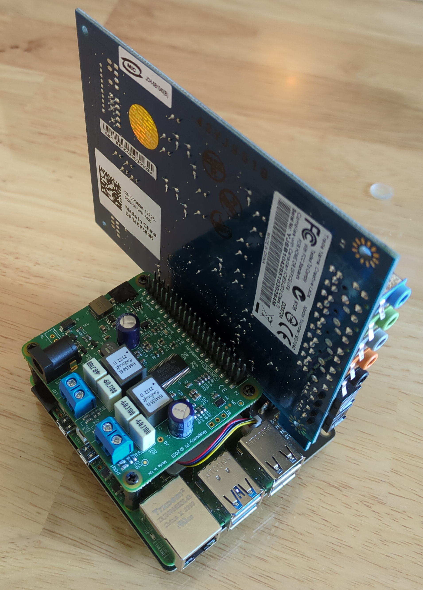
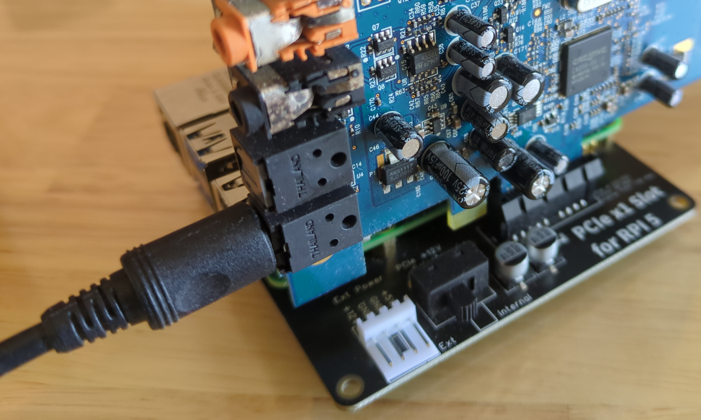
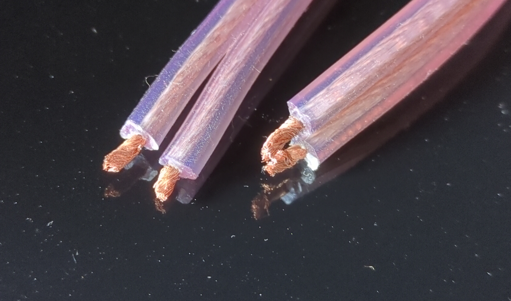
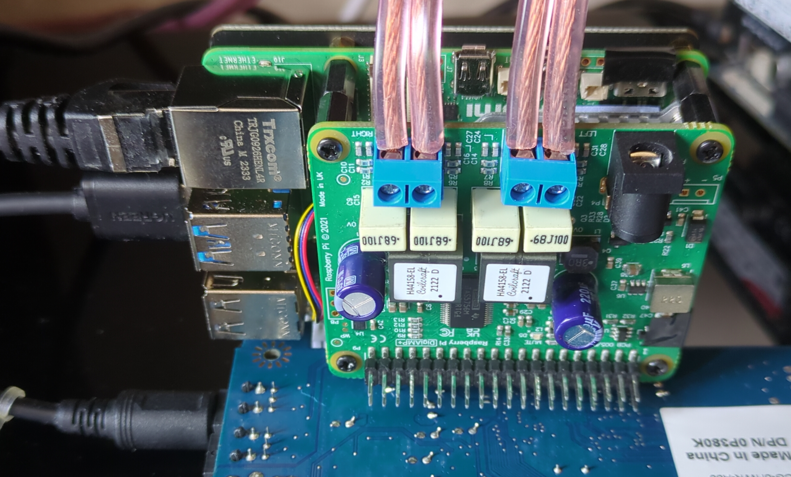

= Piceiver
Jordan Williams <jordan@jwillikers.com>
:experimental:
:icons: font
ifdef::env-github[]
:tip-caption: :bulb:
:note-caption: :information_source:
:important-caption: :heavy_exclamation_mark:
:caution-caption: :fire:
:warning-caption: :warning:
endif::[]
:deploy-rs: https://github.com/serokell/deploy-rs[deploy-rs]
:FluidSynth: https://www.fluidsynth.org/[FluidSynth]
:Home-Assistant: https://www.home-assistant.io/[Home Assistant]
:Iris: https://github.com/jaedb/Iris[Iris]
:Jellyfin: https://jellyfin.org/[Jellyfin]
:Mopidy: https://mopidy.com/[Mopidy]
:Mopidy-Jellyfin: https://github.com/jellyfin/mopidy-jellyfin[Mopidy-Jellyfin]
:Music-Assistant: https://music-assistant.io/[Music Assistant]
:Nix: https://nixos.org/[Nix]
:PipeWire: https://pipewire.org/[PipeWire]
:raspberry-pi-nix: https://github.com/nix-community/raspberry-pi-nix[raspberry-pi-nix]
:Rygel: https://gnome.pages.gitlab.gnome.org/rygel/[Rygel]
:Shairport-Sync: https://github.com/mikebrady/shairport-sync[Shairport Sync]
:Snapcast: https://github.com/badaix/snapcast[Snapcast]
:WirePlumber: https://gitlab.freedesktop.org/pipewire/wireplumber[WirePlumber]

A 2.1 channel DIY audio receiver with S/PDIF input.

ifdef::env-github[]
++++

  

++++
endif::[]

ifndef::env-github[]

endif::[]

== Synopsis

This project is a build of a 2.1 channel receiver based on the Raspberry Pi.
Out-of-the-box, it takes in audio from the digital optical input.
The receiver leverages {PipeWire} and {WirePlumber} for the audio routing and session management.
The software and configuration is built on NixOS and managed through a Nix flake in this repository.
{Nix} has quite up-to-date software, is extensively customizable, and ensures that builds are reproducible.

.Features
* 2.1 channel output
* Digital optical audio input
* Low-latency
* Realtime - for the lowest possible latency
* AirPlay
* Bluetooth
* DLNA Digital Media Renderer
* Cast directly from {Jellyfin}
* Multi-room audio
* Integrates with {Music-Assistant} and {Home-Assistant}
* MIDI Synthesizer

.Hardware
* https://www.raspberrypi.com/products/raspberry-pi-5/[Raspberry Pi 5 - 2GB RAM] $50
* https://52pi.com/products/p02-pcie-slot-for-rpi5[52Pi PCIe x1 slot for Raspberry Pi 5] $24.99
* https://www.raspberrypi.com/products/digiamp-plus/[Raspberry Pi DigiAMP+ HAT] $30.00
* https://pipci.jeffgeerling.com/cards_multimedia/creative-SB1040.html[Creative SB1040 Sound Blaster X-Fi Xtreme Audio Card] $50.00
* https://www.amazon.com/dp/B01N905VOY?psc=1&ref=ppx_yo2ov_dt_b_product_details[UGREEN USB to Audio Jack Sound Card Adapter] $13.99
* https://www.digikey.com/en/products/detail/xp-power/VEC65US19/5726823[XP Power VEC65US19 AC/DC DESKTOP ADAPTER 19V 65W] $26.94
* https://www.digikey.com/en/products/detail/bel-inc/PC-ABK001F/15777841[Power cord] $2.70
* https://www.raspberrypi.com/products/active-cooler/[Raspberry Pi Active Cooler] $5
* A sufficiently large and performant microSD card can be used instead of NVMe storage.
I recommend using larger capacity micro SD cards for increased lifespan, especially when building code on the Pi itself.
Depending on your situation, you might want to do this.
If you just need enough space to fit the image on the SD card, 16 GiB should be ample.
The https://www.samsung.com/us/computing/memory-storage/memory-cards/pro-ultimate-adapter-microsdxc-128gb-mb-my128sa-am/[128GB Samsung Pro Ultimate] and https://www.samsung.com/us/computing/memory-storage/memory-cards/pro-endurance-adapter-microsdxc-128gb-mb-mj128ka-am/[128GB Samsung Pro Endurance] are two good options. $25
* https://shop.pimoroni.com/products/extended-m2-5-standoffs-for-pi-hats?variant=41206707880019[Extended M2.5 Standoffs for Pi HATs (Raspberry Pi 5) - Pack of 4] $3.18
This is 4 17mm M2.5 Hex socket-socket standoffs and 8 6mm M2.5 screws.
* https://shop.pimoroni.com/products/booster-header?variant=47414520906[Booster Header] $2.22
This header has a standard 8.5mm height with 5mm tall pins.
* Bluetooth USB Adapter such as this https://www.amazon.com/gp/product/B09DMP6T22/ref=ox_sc_act_title_1?smid=ATVPDKIKX0DER&psc=1[TP-Link USB Bluetooth Adapter] $15.

The total price comes to a whopping _$249.02_.
That's still a bit pricey, so I'd love to get the cost down to below $200 at the very least.
However, I'm very much inclined for everything to be supported in the Linux kernel.
It's bad enough that I have to make a concession for the Amp HAT, which requires using Raspberry Pi's fork of the Linux kernel.
If you're reading this Raspberry Pi, _please upstream your audio HATs_.
I'd like to find a cheaper, newer PCIe sound card with in-kernel Linux support to provide the digital optical input and, potentially, an LFE output.
The current Sound Blaster card requires enabling extra configuration options, i.e. `CONFIG_SND_HDA_INTEL`, in the kernel config as well as adding a special `config.txt` overlay.
As for using HATs to provide these features, I'll gladly switch over if and when they are supported upstream.
Since kernel has to be compiled anyways, realtime preemption is enabled to further reduce latency.

== Assembly

Assembling the Piceiver is very straightforward.
In fact, I'm not going to go in to much detail.
There are a couple of important things that require explanation.

It's expected that the Piceiver will be connected to the network via ethernet and _not_ through WiFi.
To use WiFi, the image will need to be customized.

Do _not_ supply power through the USB-C connector on the Raspberry Pi.
I recommend covering the USB-C connector on the Raspberry Pi with a small strip of electrical tape so that you don't forget.

ifdef::env-github[]
++++

  

++++
endif::[]

ifndef::env-github[]
image::pics/Piceiver Pi 5 Side 1.jpg[Piceiver Pi 5 Side 1, align=center]
endif::[]

The digital optical input is the bottom digital optical connector on the Sound Blaster card.

ifdef::env-github[]
++++

  

++++
endif::[]

ifndef::env-github[]

endif::[]

If you use a reasonably large gauge of speaker wire, it will take some work to fit the wire into the screw terminals on the Amp HAT.
Take some time to shrink the wire a smidgen by twisting the ends.

ifdef::env-github[]
++++

  

++++
endif::[]

ifndef::env-github[]

endif::[]

Here's a picture showing all of the cables attached except for the barrel power plug.

ifdef::env-github[]
++++

  

++++
endif::[]

ifndef::env-github[]

endif::[]

== Getting Started

Installation is done by building a system image which is flashed directly to an SD card.
This can all be built and customized locally with {Nix}.
Unfortunately, unless you're building this on an aarch64 machine, it will take a significant amount of time to build.
The initial build probably took about two full days for me.

. Install an implementation of Nix, such as https://lix.systems[Lix] demonstrated in the following command.
Enable support for flakes when prompted.
+
[,sh]
----
curl -sSf -L https://install.lix.systems/lix | sh -s -- install
----

. Clone this repository.
+
[,sh]
----
git clone git@github.com:jwillikers/piceiver.git
----

. Change into the project directory.
+
[,sh]
----
cd piceiver
----

. Build the SD card image.
Prefix the command with `systemd-inhibit` to prevent your computer from sleeping.
This will take a long time.
Like, days in my case.
The default, `basic-sd-image` package, produces a minimal image that requires no extra configuration.
There is an alternative package, `full-sd-image`, which is more fully-featured, including more integrations, but requires customization and additional set up.
+
--
[,sh]
----
systemd-inhibit nix build --accept-flake-config
----

[TIP]
====
If for any reason the build fails or your computer locks up, there's a good chance that it's related to Nix attempting to build too many jobs simultaneously or not having adequate RAM space to hold the build directory for a package.
These issues can be fixed with configuration options for the Nix daemon in `/etc/nix/nix.conf`.
Use the `max-jobs` option to limit the number of simultaneous jobs.
To build only a single job at a time, this would look like `max-jobs = 1` in the config file.

To prevent running out space in RAM, set the `build-dir` option to a path that is located on disk.
The default `tmp` directory is usually stored in a special filesystem backed by RAM.
To set this to `/var/tmp/nix-daemon`, the line in the config will look like `build-dir = /var/tmp/nix-daemon`.
Be sure to create this directory.

[,sh]
----
sudo mkdir --parents /var/tmp/nix-daemon
----

To apply changes in `/etc/nix/nix.conf`, restart the Nix daemon.

[,sh]
----
sudo systemctl restart nix-daemon.service
----
====
--

. Once the image is ready, insert the SD card into your computer.

. Use `lsblk` to find the SD card.
This will probably be a device like `/dev/mmcblkX` or possibly `/dev/sdX`.
+
[,sh]
----
lsblk
----

. Flash the SD card with the image.
Replace the `/dev/mmcblkX` device path with yours.
+
--
[CAUTION]
====
Using the wrong device path could wreck your entire computer or precious data on an attached disk, so be careful to use the right path.
Or just use a safe graphical application to flash the image to your SD card.
====

[,sh]
----
nix develop --command bash -c 'sudo env "PATH=$PATH" zstdcat result/sd-image/nixos-sd-image-*-aarch64-linux.img.zst | dd bs=1M status=progress of=/dev/mmcblkX'
----
--

When booting the Piceiver for the first time, give it a few extra minutes to start working as it has to resize the filesystem.

Key-based authentication is required for the `root` user.
So, unless you've configured that, log in as the user `jordan` with the default password `opW6&Aa`.
The `root` password is `V2psT!t0`.
I recommend configuring the authorized keys for the `root` user as well as your own user in the NixOS configuration.
This is done for the `jordan` user link:nixos/_mixins/users/jordan/default.nix[here].
With SSH keys configured, I recommend completely disabling password authentication for security.
Also, you should change the default passwords for the users.
See the <<Deploy>> section for how to deploy such configuration changes to a Piceiver that's already running.

== Deploy

You may want to update or make changes to an existing Piceiver instance.
Such changes might include supplying your own SSH keys for authentication, altering the default user, changing passwords, or applying credentials for certain services.
It is possible to apply such changes as well as updates to an already running instance by using {deploy-rs}.
This should save your microSD cards from an tortured and all too brief existence.
The instructions here describe how to deploy updates to an existing Piceiver server.
It is assumed that you've already cloned the repository and changed to its directory.

. First, make your desired modifications to the configuration.
. Activate the development environment with Nix to pull in the correct version of `deploy-rs`.
+
[,sh]
----
nix develop
----
. Deploy.
This will prompt for the `sudo` password of the user `jordan`, which is `opW6&Aa` by default.
+
--
[,sh]
----
systemd-inhibit deploy --interactive-sudo true --ssh-user jordan .#piceiver
----

[TIP]
====
After deploying your own SSH key for authentication of the `root` user, the `--interactive-sudo true`  and `--ssh-user jordan` options can be omitted.
====
--

== System Organization

The PipeWire and WirePlumber sessions run under the dedicated `core` user account.
Almost all audio-related services run under this user's account because they need to interact with the PipeWire daemon.
The exception is the Snapcast server, which runs as a system service under a dedicated user because it only handles audio over the network.
The PipeWire configuration creates a virtual sink that forwards audio to both the DigiAmp+ HAT and the USB audio interface.
A loopback device is created which connects the digital optical input on the Sound Blaster card to this sink.
To reduce latency, I've lowered the quantum as low as possible until just before audio begins to stutter.
The WirePlumber configuration sets the correct device profile for the Sound Blaster card in addition to several other important tweaks like optimizations for the USB output and preventing the digital optical input from being suspended.
The default sink, default source, plus initial volume levels are configured for WirePlumber by a systemd service which runs a few seconds after the WirePlumber service starts.
Most audio applications interact directly with PipeWire, but a single holdout, the Snapcast client, is only capable of using PulseAudio's API.
Thus, the PipeWire's PulseAudio daemon is also running.

The audio routing is pretty much hard-coded for everything.
Audio from the digital optical input is assumed to require low latency and high reliability, and thus is routed directly to the combined stereo and sub output.
The digital optical input is connected to my TV, which is why it's configured this way.
The synthesizer is also routed to the combined output because that also requires low latency
All other inputs are over the network and audio only, so they are all connected to Snapcast.
The hard-coded behavior is great when you know exactly how you want everything to be routed, so this setup works really well for me.
Plus, it's one less thing I need to think about or troubleshoot.
To make it possible to switch between outputs, I'd need to add a button and some kind of indicator to the Piceiver so you could properly switch between them on the device.

// todo Create a pretty graph of the audio sources and sinks.

=== AirPlay

https://www.apple.com/airplay/[AirPlay], specifically Airplay 2, is supported via {Shairport-Sync}.
It works very nicely.
AirPlay 1 doesn't appear to work at all, however.
This may be fixed when `shairport-sync` is updated in NixOS 24.11.

=== Bluetooth

Bluetooth streaming is supported.
Just pair your device with the receiver.
The Piceiver is only discoverable for the first five minutes after it boots.
Since it has no way to either display a pin or enter one, it accepts connections from anyone.
The timeout limits the window where an unwanted guest may hijack your receiver.
Only one device may be connected at a time.
If you get a prompt for a pin code for some reason, try entering `0000`.
It can be a bit finicky pairing my Android phone, so just give it a couple minutes after it disconnects to reconnect and get everything figured out.
My wife's iPhone paired much more easily over Bluetooth.
A dedicated button to enter Bluetooth pairing mode would be really helpful.
I've not yet tested whether Bluetooth MIDI works.

=== DLNA Digital Media Renderer

{Rygel} provides a DLNA/UPnP Digital Media Renderer which can be used to playback audio from services that support the protocol.

=== Jellyfin

If you have a {Jellyfin} media server, you can cast directly to the Piceiver via {Mopidy} and the {Mopidy-Jellyfin} plugin.
This requires the user credentials and the address of your Jellyfin server.
Once configured, Jellyfin's web interface can be used to cast directly to the device.
I'm planning on adding support for using secrets to populate credentials like this in the image.
That could well end up being super complicated and not be worth it if you just want to get things set up.
It's possible to configure credentials locally in the repository and deploy them to your server by following the instructions in the <<Deploy>> section.

[TIP]
====
A Mopidy web server is available at `piceiver.local:6680/iris/`.
The UI is provided by the {Iris} extension.
This is nifty if you want to allow others to stream from your Jellyfin instance without requiring them to log to your Jellyfin account as your user.
====

=== Multi-room Audio with Snapcast

Multi-room audio is handy feature, it's been incorporated in the Piceiver thanks to the {Snapcast} project.
I haven't found anything to package up something to manage multi-room audio via PipeWire, although I'm certain it's possible.
Until someone makes something like that, Snapcast is a great open-source solution for multi-room audio.
Since it doesn't integrate directly with PipeWire, there will likely be an additional level of latency introduced by PipeWire.
The Snapcast control webserver is accessible at `piceiver.local:1780`.

[NOTE]
====
Snapcast introduces a substantial amount of latency in order to synchronize playback between the various playback clients.
This isn't much of a problem when playing music, audio books, or podcasts.
However, you'll want to avoid using it as the sink for video playback or any kind of realtime audio interactions such as calls, Mumble, etc.
====

==== Snappellite

A Raspberry Zero 2W and DAC Pro HAT _would_ make a great combination for creating a remote playback satellite that you can attach to a set of speakers in another location.
Alas, it's been a couple of years at this point where I can get the darn thing to not kernel panic when using a USB ethernet adapter.
So, I recommend a Raspberry PI 4 B instead at this point.
If you opt for a USB audio device instead of the DAC Pro, you can even use a mainline kernel!
I call it _Snappellite_ for _Snapcast Satellite_.

// todo Actually add this picture?
// ifdef::env-github[]
// ++++
// 

//   
// 

// ++++
// endif::[]

// ifndef::env-github[]
// image::pics/Snappellite.jpg[Snappellite, align=center]
// endif::[]

.Snappellite Hardware
* https://www.raspberrypi.com/products/raspberry-pi-zero-2-w/[Raspberry Pi 4 Model B - 2GB] _$45_
* https://www.raspberrypi.com/products/dac-pro/[Raspberry Pi DAC Pro HAT] _$25_ or, alternatively, a https://www.amazon.com/gp/product/B01N905VOY[USB audio adapter] _$15_
* https://www.adafruit.com/product/2992[Ethernet Hub and USB Hub w/ Micro USB OTG Connector] _$14.95_
* https://www.raspberrypi.com/products/type-c-power-supply/[Raspberry Pi 15W USB-C Power Supply] _$8_
* https://www.amazon.com/Silicon-Power-Speed-MicroSD-Adapter/dp/B07Q384TPK[32 GB microSD Card] _$8.99_

Total Cost:: _$91.94 - 101.94_ USD

Oh, I really need to stop doing the math on how much these component costs.
I've spent way too much on all of this.

I've configured an SD image target for it, `snappellite-sd-image`.
Build it with Nix build.

[,sh]
----
nix build .#snappellite-sd-image
----

It still takes forever to build, so feel free to grab some of your favorite on-brand iced tea while you wait.

==== Stream Directly to the Snapcast Server with PipeWire

PipeWire 1.2.0 added the https://docs.pipewire.org/page_module_snapcast_discover.html[Snapcast Discover module].
This module makes it really easy to set up a stream from any device running PipeWire, like your laptop.
Or maybe your phone.
I don't want to assume anything about your sanity or lack thereof.
To actually configure the Snapcast server to use the input stream, you'll probably want to use https://github.com/badaix/snapdroid[Snapdroid] or alternatively https://github.com/badaix/snapweb[Snapweb] directly from your browser.
There's also a bunch of other https://github.com/badaix/snapcast?tab=readme-ov-file#contributions[third-party integrations] available.
To use this module, configure PipeWire to load it with the appropriate settings on your device.
The steps here walk through how to do this.

. Create the configuration directory for PipeWire for your user.
+
[,sh]
----
mkdir --parents ~/.config/pipewire/pipewire.conf.d
----

. Drop in and configure the the Snapcast Discover module in a config file fragment.
+
.~/.config/pipewire/pipewire.conf.d/51-snapcast-discover.conf
[,lua]
----
context.modules = [
{   name = libpipewire-module-snapcast-discover
  args = {
    stream.rules = [
      {   matches = [
          {
                snapcast.ip = "~.*"
          }
      ]
          actions = {
              create-stream = {
                  audio.rate = 48000
                  audio.format = S16LE
                  audio.channels = 2
                  audio.position = [ FL FR ]
                  node.name = "Piceiver Snapcast Sink"
                  # If your firewall blocks ephemeral ports, open those ports or open the specific port in the following line and uncomment it.
                  # Only after considering the security implications, of course.
                  # server.address = [ "tcp:4711" ]
                  snapcast.stream-name = "My Laptop"
                  capture = true
                  capture.props = {
                      media.class = "Audio/Sink"
                  }
              }
          }
      }
    ]
  }
}
]
----

. Restart PipeWire to load the module.
+
[,sh]
----
systemctl --user restart pipewire
----

. Now you should be able see an additional stream available for Snapcast in the app, web interface, or what have you.

=== Music Assistant

The Piceiver may be integrated with {Music-Assistant} as an external Snapcast server as well as a UPnP/DLNA player provider.
The external Snapcast server option will create a Snapcast stream specific to Music Assistant.
It may be less disruptive to your Snapcast configuration to use the UPnP/DLNA player provider instead.
The AirPlay player provider relies on AirPlay 1 and will not work with AirPlay 2 support in shairport-sync enabled.
It can likewise be incorporated directly in {Home-Assistant} using either the Snapcast or DLNA integrations or directly via Music Assistant.

=== Synthesizer

USB MIDI keyboards are plug-and-play with the Piceiver thanks to the {FluidSynth} software synthesizer.
Just plug in the keyboard and FluidSynth will translate the MIDI messages and output the audio through the stereo.
A systemd service for the `core` user runs FluidSynth in the background.
The command-line flags to the service can be configured via Nix or on the Pi itself by running the following command-line as the `core` user.

[,sh]
----
systemctl --user edit fluidsynth.service
----

After making modifications, be sure to restart the service.

[,sh]
----
systemctl --user restart fluidsynth.service
----

=== Security

The Piceiver is admittedly, not the most secure thing out-of-the-box.
It's running services listening on several ports, including open web interfaces for controlling audio streaming and accessing your media.
The Bluetooth is not particularly secure either, since nothing prevents someone from pairing.
This device is intended for use in a private network, like a home network, and even there it is still important to consider access and if anyone on your network should be able to control the receiver server.

=== Switch to the core User

It's not possible to log in to the `core` user account, but is possible to use `sudo` to switch to it.
This isn't possible when using the basic image because that doesn't have an account with which to log in.
Add a root password or another user account, like in the custom image, to be able to log in.
The following command can be used to switch to the `core` user account.
I use the fish shell, by the way.

[,sh]
----
sudo -H -u core fish -c 'cd; fish'
----

== Performance

The following table shows some performance benchmarks which were obtained using `pw-top`.
This table includes my original prototype based off of the Raspberry Pi Compute Module 4, which used Raspberry Pi OS 5 based on Debian Bookworm.

.Piceiver Performance
[,cols="1,1,1,1,1,1,1,1,1,1,1,1"]
|===
| Raspberry Pi Model
| OS
| Kernel
| PipeWire Version
| WirePlumber Version
| Quantum
| Rate
| Active CPU Usage
| Idle CPU Usage
| RAM Usage
| Latency (μs)
| Notes

| CM4 8GiB RAM, no WiFi
| Raspberry Pi OS 5 (Debian Bookworm)
| Linux 6.1.54-rt15
| 0.82.0
| 0.4.15
| 128
| 48,000
| 10-20%
| 5-10%
| 0.3%
| 100-400
| Without Snapcast and Jellyfin MPV Shim.
No LFE or upmixing.

| Pi 5 Model B, 8GiB RAM
| Raspberry Pi OS 5 (Debian Bookworm)
| Linux 6.1.54-rt15
| 1.0.6
| 0.5.2
| 512
| 48,000
| 10-20%
| 5-10%
| 0.3%
| 100-200
|

// todo I need to update these numbers after the initial release.
// | Pi 5 Model B, 8GiB RAM
// | NixOS 24.05
// | Linux 6.6.54
// | 1.0.7
// | 0.5.3
// | 64
// | 48,000
// | 5%
// | 4%
// | 0.2%
// | ~40
// |

|===

== Todo

There's a lot left I need to complete.
The custom image, which is tailored for my personal usage, still has many outstanding tasks.
First, the Nix stuff needs cleaned up.
Significantly.
My primary focus now is to add support for secrets handling via sops-nix in the configuration to allow me to set things like passwords as well as credentials for my Jellyfin server.
Then, there's still the fact there's not a proper plan in place for managing and updating the installation.
Using a new image every time isn't gonna fly with flash storage or the value of anybody's time, so figuring out deployment is a high priority.
After that, I need to figure out how to configure Net-SNMP in NixOS, as monitoring is a really nice feature to have in place.

.Todo
* Use a reverse-proxy for the Snapcast and Mopidy servers?
* Fix the sub flipping on and off when idle.
* Auto-mute speakers and subwoofer when nothing is being output.
I think that the constant input from the digital optical input causes this.
However, I have to disable suspend for that node otherwise nothing ever comes through.
* FCast for streaming, but right now I'd have to write a receiver for audio only myself and then I'd have to write integrations and apps that actually use the protocol.
* Snapcast microcontroller for playback
* Copy nixos configuration or flake to /etc/ in the image?
* Add a button to trigger Bluetooth pairing.
* Test how well the onboard Bluetooth works for the Pi 5.
* Use nix-sops for secret management
* Configure monitoring over Net-SNMP
* A mechanism for switching the output, so as to choose between the lower latency stereo output or the Snapcast output.
* Automatic updates?
* Better filesystem such as Bcachefs or Btrfs
* Automatically log in to Tailscale
* Remove a bunch of extra dependencies that nixpkgs pulls in but that isn't necessary.
* Script for collecting performance metrics?
* LFE
* Bluetooth MIDI
* SELinux
* Case
* Low-cost

== References

.Documentation
* https://www.fluidsynth.org/api/fluidsettings.html[FluidSynth Settings Documentation]
* https://docs.mopidy.com/latest/[Mopidy Documentation]
* https://jellyfin.org/docs/general/clients/mopidy[Mopidy Jellyfin Documentation]
* https://nixos.org/manual/nixos/stable/[NixOS Manual]
* https://docs.pipewire.org/[PipeWire Documentation]
* https://github.com/mikebrady/shairport-sync/blob/master/scripts/shairport-sync.conf[shairport-sync Configuration]
* https://github.com/badaix/snapcast/blob/develop/doc/configuration.md[Snapcast Configuration]
* https://pipewire.pages.freedesktop.org/wireplumber/[WirePlumber Documentation]

// todo Add more.
.Related Projects
* https://github.com/nicokaiser/rpi-audio-receiver[Raspberry Pi Audio Receiver]

== Contributing

Contributions in the form of issues, feedback, and even pull requests are welcome.
Make sure to adhere to the project's link:CODE_OF_CONDUCT.adoc[Code of Conduct].

== Open Source Software

This project is built on the hard work of countless open source contributors.
A few of these projects are enumerated below.

* https://asciidoctor.org/[Asciidoctor]
* {deploy-rs}
* {FluidSynth}
* {Iris}
* {Jellyfin}
* https://www.linuxfoundation.org/[Linux]
* {Mopidy}
* {Mopidy-Jellyfin}
* {Nix}
* {PipeWire}
* {Rygel}
* {raspberry-pi-nix}
* {Shairport-Sync}
* {Snapcast}
* {WirePlumber}

== Code of Conduct

The project's Code of Conduct is available in the link:CODE_OF_CONDUCT.adoc[Code of Conduct] file.

== License

This repository is licensed under the link:LICENSE[MIT license].

© 2024 Jordan Williams

== Authors

mailto:{email}[{author}]
